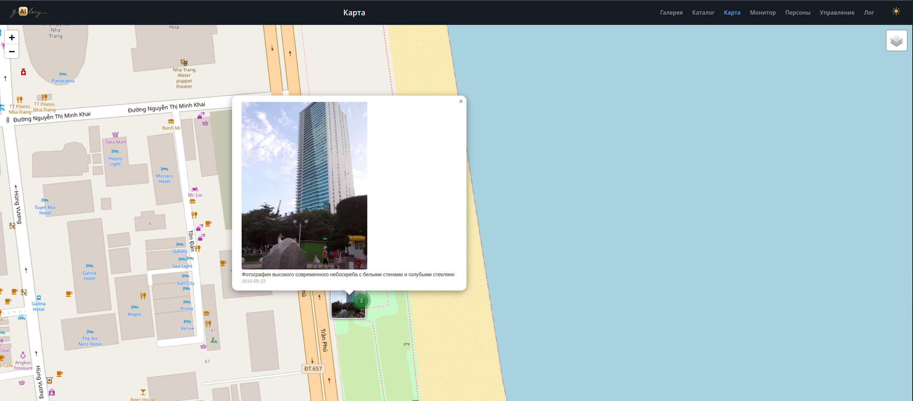
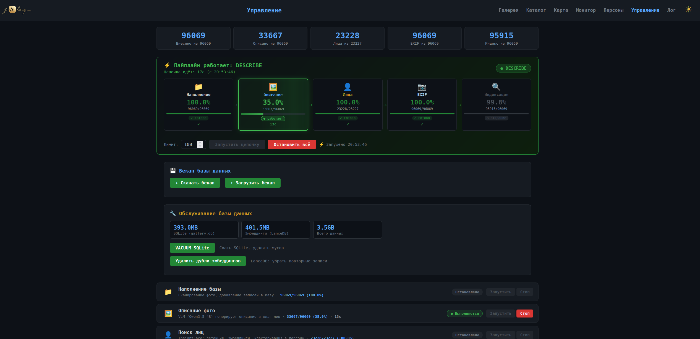

#  Gailery — AI-фотогалерея для домашнего файлового сервера

**Gailery** — локальная AI-фотогалерея для домашнего NAS/файлопомойки. Индексирует многолетний архив фотографий, генерирует описания, находит лица и людей, организует семантический поиск. Всё работает на одной дешёвой GPU — без облака, без подписок, без отправки ваших фото куда-либо.

**Ключевой принцип: фото-архив — неприкосновенен.** Gailery никогда не пишет в папку с фотографиями. Все описания, имена, эмбеддинги, миниатюры — хранятся в собственной базе проекта. Оригинальные файлы только читаются.

---

## Скриншоты

### Галерея

Сетка фотографий с таймлайном, поиском (точный + смысловой), слайдшоу, обогащёнными AI-описаниями. Светлая тема.

### Карта

Интерактивная GPS-карта (Leaflet). Фото с координатами — точки на карте, при зуме 15+ превращаются в миниатюры. Кластеры группируют близкие фото. Попап с описанием и датой, reverse geocoding, ручная привязка GPS. Переключение слоёв: схема / спутник.

### Управление

Панель управления: запуск пайплайна, бекап/рестор базы, обслуживание (VACUUM, дедупликация). Тёмная тема.

---

## Типичный сценарий

У вас дома стоит сервер — обычный ПК с несколькими дисками. На нём годами копились фотографии: семейные, с поездок, с телефонов. Тысячи и десятки тысяч файлов в папках типа `2023/2023_06_20 - День рождения/`. Найти что-то конкретное невозможно — нет описаний, нет тегов, никто не помнит где что.

Gailery решает это:
- Сканирует всё, вытягивает EXIF (дата, GPS, камера)
- AI описывает каждую фотографию на русском языке
- Находит лица на фото, группирует в персоны, вы можете дать им имена
- Обогащает описания — вместо «мужчина в чёрной куртке» пишет «Петров Алексей»
- Появляется смысловой поиск: «семья на пляже» — и находятся фото, даже если в описании написано иначе
- GPS-карта, таймлайн по годам, слайдшоу

Всё это — дома, на вашем железе, ваши данные не уходят.

---

## Пример развёртывания: Proxmox + LXC + GPU

Ниже — реальный рабочий конфиг. Gailery крутится в LXC-контейнере на домашнем Proxmox-сервере, выполняя одновременно роль файловой шары и фотогалереи.

### Железо

| Компонент | Пример | Комментарий |
|-----------|--------|-------------|
| Сервер | Любой ПК | Достаточно i3/i5 + 8GB RAM |
| GPU | NVIDIA P104-100 | Бывшая майнинговая, 8GB VRAM, ~$30 на вторичке. Pascal SM 6.1 — старая, но для inference хватает |
| Диски | HDD/SSD + NFS/SMB | Фото-архив может быть на отдельном диске или NAS |

P104-100 — идеальная «домашняя AI-карта»: дешёвая, 8GB VRAM, пассивное охлаждение, тянет Qwen3.5-4B (VLM описание) + InsightFace (лица) + Qwen3-Embedding (эмбеддинги). GPU используется по очереди, одновременно только одна модель — 8GB хватает.

### Архитектура

```
┌─────────────────────────────────────────────────┐
│  Proxmox VE                                      │
│                                                   │
│  ┌─────────────────────────────────────────────┐ │
│  │  LXC контейнер (CT)                         │ │
│  │                                              │ │
│  │  /mnt/photos ──► SMB mount (read-only)      │ │
│  │       или bind mount с хоста                 │ │
│  │                                              │ │
│  │  Gailery:                                    │ │
│  │   • FastAPI (порт 8000)                      │ │
│  │   • SQLite + LanceDB (в контейнере)          │ │
│  │   • Модели GGUF (в контейнере)               │ │
│  │   • Миниатюры WebP (в контейнере)            │ │
│  │   • GPU NVIDIA (проброс, shared mode)       │ │
│  │                                              │ │
│  │  Samba:                                      │ │
│  │   • Файловая шара для домашних устройств    │ │
  │  │   • /mnt/photos → домашний фото-архив            │ │
│  └─────────────────────────────────────────────┘ │
│                                                   │
│  GPU: NVIDIA P104-100 → проброс в LXC             │
│  HDD: /dev/sda1 → mount → /mnt/photos             │
└─────────────────────────────────────────────────┘
```

### Proxmox: создание контейнера с GPU

```bash
# 1. Создаём привилегированный LXC (нужен для GPU и nvidia-smi)
pct create 101 local:vztmpl/debian-12-standard_12.2-1_amd64.tar.zst \
  --hostname gailery \
  --cores 4 \
  --memory 8192 \
  --rootfs local-lvm:50 \
  --net0 name=eth0,bridge=vmbr0,ip=dhcp \
  --features nesting=1 \
  --unprivileged 0

# 2. Пробрасываем GPU (shared mode — хост тоже может использовать)
# В /etc/pve/lxc/101.conf добавляем:
cat >> /etc/pve/lxc/101.conf << 'EOF'
lxc.cgroup2.devices.allow: c 195:0 rw
lxc.cgroup2.devices.allow: c 195:255 rw
lxc.cgroup2.devices.allow: c 509:0 rw
lxc.mount.entry: /dev/nvidia0 dev/nvidia0 none bind optional 0 0
lxc.mount.entry: /dev/nvidiactl dev/nvidiactl none bind optional 0 0
lxc.mount.entry: /dev/nvidia-uvm dev/nvidia-uvm none bind optional 0 0
lxc.mount.entry: /dev/nvidia-uvm-tools dev/nvidia-uvm-tools none bind optional 0 0
EOF

# 3. Пробрасываем папку с фото (bind mount, read-only)
echo "mp0: /mnt/photos,mp=/mnt/photos,ro=1" >> /etc/pve/lxc/101.conf

# Или: монтируем SMB-шару внутри контейнера (read-only)
# apt install cifs-utils
# mount -t cifs //NAS/photos /mnt/photos -o ro,username=guest,password=

# 4. Запускаем
pct start 101
pct enter 101
```

### Доступ к фото-архиву

Gailery нужна **только чтение** — она никогда не модифицирует оригинальные файлы. Варианты:

| Способ | Описание |
|--------|----------|
| Bind mount | `mp0: /mnt/photos,mp=/mnt/photos,ro=1` в конфиге LXC — самый простой |
| SMB/CIFS | `mount -t cifs //NAS/photos /mnt/photos -o ro` — если фото на другом сервере |
| NFS | `mount -t nfs nas:/photos /mnt/photos -o ro` — для NAS типа Synology |

Все описания, имена людей, эмбеддинги, миниатюры — **внутри контейнера**, в `data/` и `thumbnails/`. Фото-архив остаётся нетронутым.

---

## Возможности

- **AI-описание фото** — VLM (Qwen3.5-4B) генерирует описания на русском языке через llama-server
- **Обогащение описаний** — LLM подставляет имена людей, контекст папок и дат (tool-calling с 3 инструментами)
- **Детекция лиц** — InsightFace buffalo_l (GPU, onnxruntime CUDA): детекция + 512-dim эмбеддинги
- **Кластеризация персон** — DBSCAN (cosine, eps=0.4) инкрементально: существующие персоны не пересчитываются
- **Семантический поиск** — Qwen3-Embedding-0.6B (1024-dim), LanceDB cosine similarity
- **Текстовый поиск** — SQL LIKE по описаниям
- **EXIF-метаданные** — дата, GPS, камера, ISO, фокусное расстояние
- **GPS-карта** — Leaflet + markercluster, reverse geocoding
- **Каталог файлов** — сканирование источников, отслеживание статуса обработки
- **Веб-интерфейс** — галерея с таймлайном, слайдшоу, тёмная/светлая тема, адаптивный логотип
- **Бекап/рестор** — скачать/залить базу данных через веб-интерфейс
- **Обслуживание БД** — VACUUM SQLite, дедупликация LanceDB, размеры в реальном времени

## Стек

| Компонент | Технология |
|-----------|------------|
| Backend | Python 3.12, FastAPI, Uvicorn |
| БД | SQLite (метаданные) + LanceDB (векторы) |
| VLM описание | Qwen3.5-4B GGUF Q4_K_M через llama-server (порт 8101) |
| LLM обогащение | Qwen3.5-4B GGUF через llama-server (порт 8103, tool-calling) |
| Эмбеддинги | Qwen3-Embedding-0.6B: PyTorch CUDA (пайплайн) + GGUF (поиск, порт 8102) |
| Лица | InsightFace buffalo_l (onnxruntime-gpu 1.18, CUDA, SCRFD+ArcFace) |
| Кластеризация | scikit-learn DBSCAN (cosine) |
| EXIF | ExifRead + Pillow |
| Миниатюры | pyvips (WebP, 3 размера: sm=400, md=800, lg=1200) |
| Inference сервер | llama.cpp (llama-server, кастомные CUDA kernels, без cuDNN) |
| Frontend | Vanilla HTML/CSS/JS, Leaflet.js |

---

## Установка и развёртывание

### 1. Системные требования

- **ОС**: Ubuntu 22.04+ / Debian 12+
- **GPU**: NVIDIA с CUDA support, минимум 6GB VRAM (проверено на P104-100 8GB, Pascal SM 6.1)
- **CUDA**: 12.x (Toolkit установлен на хосте/контейнере)
- **Python**: 3.12
- **RAM**: 8GB+
- **Диск**: ~10GB под модели + место под миниатюры и БД (пропорционально количеству фото)

### 2. Клонирование

```bash
git clone https://github.com/siv237/gailery.git /opt/gailery
cd /opt/gailery
```

### 3. Переменные окружения

```bash
cp .env.example .env
```

Отредактируйте `.env`:

```bash
PHOTO_SHARE_PATH=/mnt/photos                # Папка с фото (read-only достаточно!)
GALLERY_DATA_DIR=/opt/gailery/data          # SQLite + LanceDB
GALLERY_THUMBNAILS_DIR=/opt/gailery/thumbnails
GALLERY_LOGS_DIR=/opt/gailery/logs
LLAMA_CPP_DIR=/opt/llama.cpp                # Папка куда собран llama.cpp
GALLERY_VENV_PYTHON=/opt/gailery/venv/bin/python3
```

### 4. Python-окружение

```bash
python3 -m venv /opt/gailery/venv
source /opt/gailery/venv/bin/activate
pip install --upgrade pip wheel setuptools
pip install -r requirements.txt
```

> **Важно для onnxruntime-gpu**: Pascal (SM 6.1) требует cuDNN 8.x. cuDNN 9.x не работает.
> Пакет `nvidia.cudnn` версии 8 ставится через pip (см. ниже).

### 5. Сборка llama.cpp

llama-server используется для VLM описаний, обогащения текстов и эмбеддингов поиска.

```bash
git clone https://github.com/ggml-org/llama.cpp.git /opt/llama.cpp
cd /opt/llama.cpp

# Сборка с CUDA (без cuDNN — кастомные CUDA kernels)
cmake -B build -DGGML_CUDA=ON
cmake --build build --config Release -j$(nproc)
```

После сборки бинарник: `/opt/llama.cpp/build/bin/llama-server`

### 6. Скачивание моделей

Все GGUF-модели кладутся в `/opt/gailery/gguf/`:

```bash
mkdir -p /opt/gailery/gguf
```

#### 6.1. Qwen3.5-4B — VLM описание + LLM обогащение (2 файла)

```bash
cd /opt/gailery/gguf

# Основная модель (Q4_K_M, ~2.7GB)
wget https://huggingface.co/Qwen/Qwen3.5-4B-GGUF/resolve/main/qwen3.5-4b-q4_k_m.gguf \
     -O Qwen3.5-4B-Q4_K_M.gguf

# Мультимодальный проектор (BF16, ~675MB) — нужен только для VLM описания
wget https://huggingface.co/Qwen/Qwen3.5-4B-GGUF/resolve/main/mmproj-BF16.gguf \
     -O mmproj-BF16.gguf
```

#### 6.2. Qwen3-Embedding-0.6B — семантический поиск и эмбеддинги

Используется в двух форматах:
- **PyTorch** (HuggingFace) — батч-эмбеддинги в пайплайне
- **GGUF** — on-demand поиск через llama-server

```bash
# GGUF для поиска (~1.2GB)
cd /opt/gailery/gguf
wget https://huggingface.co/Qwen/Qwen3-Embedding-0.6B-GGUF/resolve/main/qwen3-embedding-0.6b-f16.gguf \
     -O Qwen3-Embedding-0.6B-F16.gguf

# PyTorch модель — скачивается автоматически при первом запуске embed.py
# Или заранее:
pip install huggingface_hub
huggingface-cli download Qwen/Qwen3-Embedding-0.6B
```

#### 6.3. InsightFace — детекция лиц

Скачивается автоматически при первом запуске `faces.py` в `~/.insightface/models/`.

Если нет интернета на сервере:

```bash
mkdir -p ~/.insightface/models/buffalo_l
cd ~/.insightface/models/buffalo_l
wget https://github.com/deepinsight/insightface/releases/download/v0.7/buffalo_l.zip
unzip buffalo_l.zip && rm buffalo_l.zip
```

### 7. cuDNN 8 для onnxruntime-gpu (Pascal)

```bash
pip install nvidia.cudnn==8.9.7.29

echo "/opt/gailery/venv/lib/python3.12/site-packages/nvidia/cudnn/lib" > /etc/ld.so.conf.d/gailery-cudnn.conf
echo "/opt/gailery/venv/lib/python3.12/site-packages/nvidia/cublas/lib" >> /etc/ld.so.conf.d/gailery-cudnn.conf
ldconfig
```

### 8. Создание директорий

```bash
mkdir -p /opt/gailery/{data,thumbnails,logs}
```

### 9. systemd сервис

```bash
cat > /etc/systemd/system/gailery.service << 'EOF'
[Unit]
Description=Gailery Photo Gallery API
After=network.target

[Service]
EnvironmentFile=/opt/gailery/.env
Type=simple
User=root
WorkingDirectory=/opt/gailery/src
Environment="PATH=/opt/gailery/venv/bin:/usr/bin:/bin"
Environment="PYTHONPATH=/opt/gailery/src"
ExecStart=/opt/gailery/venv/bin/uvicorn main:app --host 0.0.0.0 --port 8000
Restart=always
RestartSec=10
StandardOutput=append:/opt/gailery/logs/gailery.log
StandardError=append:/opt/gailery/logs/gailery-error.log

[Install]
WantedBy=multi-user.target
EOF

systemctl daemon-reload
systemctl enable gailery
systemctl start gailery
```

### 10. Первый запуск

```bash
source /opt/gailery/venv/bin/activate
export PYTHONPATH=/opt/gailery/src

# 1. Сканирование фото-коллекции
python scan_catalog.py --scan

# 2. Наполнение БД (первые 100 фото для проверки)
python ingest.py --random 100

# 3. EXIF-метаданные
python exif.py --all

# 4. AI-описание (VLM, ~7 мин на 100 фото)
python describe.py --limit 100

# 5. Детекция лиц
python faces.py

# 6. Эмбеддинги для поиска
python embed.py

# 7. Миниатюры
python generate_thumbnails.py

# 8. Обработка всей коллекции (автоматический цикл)
python pipeline.py
```

Галерея доступна: `http://YOUR_SERVER:8000/gallery`

### Проверка установки

```bash
curl http://localhost:8000/api/status
nvidia-smi
python -c "import torch; print('CUDA:', torch.cuda.is_available())"
python -c "import onnxruntime; print('ORT:', onnxruntime.get_available_providers())"
ls /opt/gailery/gguf/
```

---

## Пайплайн обработки

```
scan_catalog → ingest → describe (VLM) → faces (InsightFace) → exif → embed
```

GPU используется по очереди: VLM → InsightFace → PyTorch. Одновременно только один GPU-процесс.

### Модели GPU

| Модель | Формат | Размер | Порт | Назначение |
|--------|--------|--------|------|-----------|
| Qwen3.5-4B | GGUF Q4_K_M | 2.7 GB | 8101 | VLM описание (с mmproj, 675MB) |
| Qwen3.5-4B | GGUF Q4_K_M | 2.7 GB | 8103 | LLM обогащение (text, tool-calling) |
| Qwen3-Embedding-0.6B | GGUF F16 | 1.2 GB | 8102 | Эмбеддинги для поиска (on-demand) |
| Qwen3-Embedding-0.6B | PyTorch fp16 | ~1.2 GB | — | Батч-эмбеддинги (пайплайн) |
| InsightFace buffalo_l | ONNX | ~100 MB | — | Детекция + эмбеддинги лиц |

---

## API

### Фото
- `GET /api/photos/search` — текстовый поиск (q, persona, date, sort, limit)
- `GET /api/photos/semantic_search` — семантический поиск
- `GET /api/photos/dates` — гистограмма по годам
- `GET /api/photos/thumbnail?path=&size=` — миниатюра
- `GET /api/photos/face/{face_id}` — кроп лица
- `POST /api/photos/{id}/enrich` — обогащение описания
- `PUT /api/photos/{id}/rich_description` — сохранение описания

### Персоны
- `GET /api/persons` — список персон
- `POST /api/persons/{id}/name` — установить имя
- `POST /api/persons/merge` — объединить персоны

### Бекап и обслуживание
- `GET /api/backup/download` — скачать gallery.db.gz
- `POST /api/backup/upload` — залить бекап БД
- `GET /api/maintenance/stats` — размеры БД
- `POST /api/maintenance/vacuum` — VACUUM SQLite
- `POST /api/maintenance/dedup_embeddings` — дедупликация LanceDB

### Управление
- `POST /api/control/start` — запуск пайплайна
- `POST /api/control/stop` — остановка

## Веб-страницы

| Страница | Назначение |
|----------|-----------|
| `/gallery` | Галерея: сетка, поиск (точный + смысловой), таймлайн, слайдшоу, обогащение описаний |
| `/persons` | Персоны: имена, автокомплит, превью лиц |
| `/control` | Управление пайплайном, бекап, обслуживание БД |
| `/catalog` | Каталог источников файлов |
| `/map` | GPS-карта (Leaflet) |
| `/log` | Лог пайплайна |

## Структура проекта

```
gailery/
├── src/
│   ├── main.py                  # FastAPI приложение
│   ├── database.py              # DatabaseManager (SQLite + LanceDB)
│   ├── config.py                # Конфигурация (env vars)
│   ├── cluster_personas.py      # Кластеризация DBSCAN
│   ├── thumbnails.py            # pyvips миниатюры
│   ├── persona.py               # Persona CRUD
│   └── api/
│       ├── photos.py            # Фото API (search, semantic, enrich, thumbnail)
│       ├── persons.py           # Персоны API
│       └── catalog.py           # Каталог API
├── web/                         # HTML-страницы (vanilla JS)
│   ├── gallery.html             # Основная галерея (~2100 строк)
│   ├── personas.html            # Персоны
│   ├── control.html             # Управление + бекап + обслуживание
│   ├── catalog.html             # Каталог
│   ├── map.html                 # GPS-карта
│   ├── log.html                 # Лог
│   ├── logo-dark.png            # Логотип (тёмная тема)
│   └── logo-light.png           # Логотип (светлая тема)
├── gguf/                        # GGUF модели (not in git)
├── data/                        # SQLite + LanceDB (not in git)
├── venv/                        # Python venv (not in git)
├── thumbnails/                  # WebP миниатюры (not in git)
├── logs/                        # Логи (not in git)
├── pipeline.py                  # Оркестратор пайплайна
├── ingest.py                    # Наполнение БД
├── describe.py                  # Оркестратор VLM
├── vision_describe.py           # VLM описания (llama-server:8101)
├── faces.py                     # InsightFace + кластеризация
├── exif.py                      # EXIF-метаданные
├── embed.py                     # PyTorch эмбеддинги
├── enrich_description.py        # LLM обогащение (llama-server:8103, tool-calling)
├── scan_catalog.py              # Скан каталога
├── generate_thumbnails.py       # Генерация миниатюр (pyvips)
├── .env.example                 # Шаблон окружения
└── AGENTS.md                    # Контекст для AI-агентов
```

## Известные ограничения

- **Pascal SM 6.1**: cuDNN 9.x не работает, нужен 8.x; torch.compile не работает (Triton требует SM 70+)
- **GPU разделена**: VLM, InsightFace, PyTorch, llama-server — работают по очереди
- **Семантический поиск**: паузит пайплайн, стартует llama-server для эмбеддингов
- **Read-only**: Gailery не модифицирует оригинальные фото — это фича, а не баг
