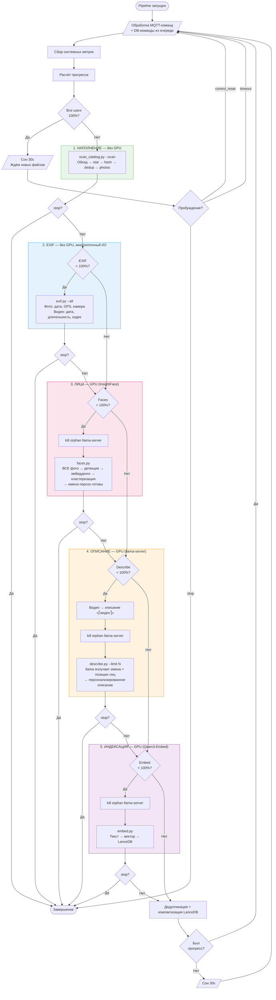
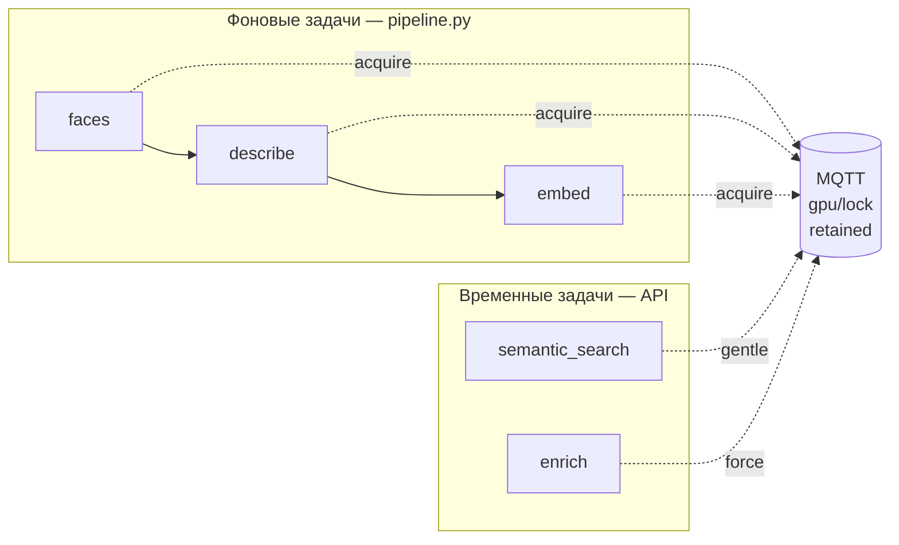
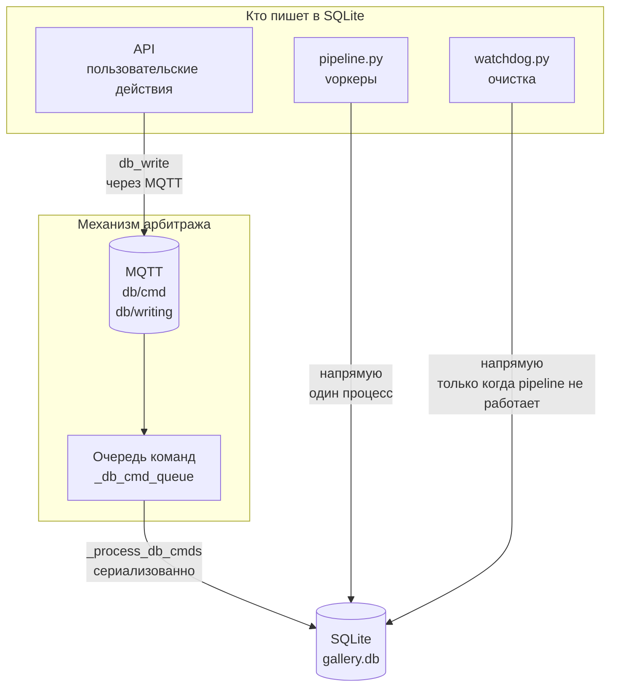
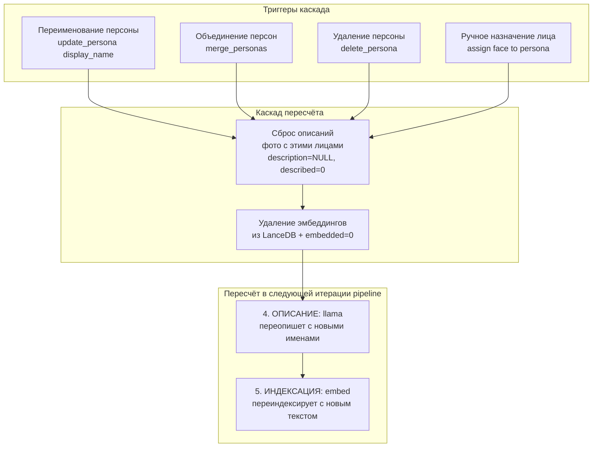
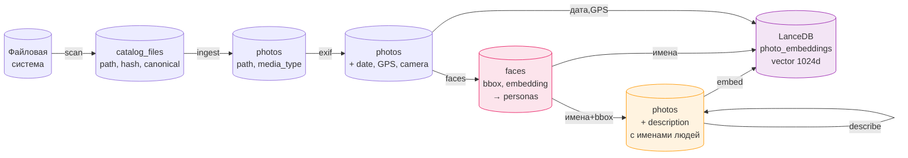

# PIPELINE.md — Идеальный пайплайн Gailery

> Этот документ описывает **оптимальный** пайплайн обработки фотографий.
> Порядок шагов выбран для максимальной пользы пользователю и качества данных.

---

## Графическая схема

### Mermaid-диаграмма (основной цикл)



### ASCII-схема (для терминала)

```
┌─────────────────────────────────────────────────────────────────┐
│                    PIPELINE.PY — ГЛАВНЫЙ ЦИКЛ                   │
└─────────────────┬───────────────────────────────────────────────┘
                  ▼
        ┌─────────────────┐
        │  MQTT-команды   │◄──────────────────────────────────────┐
        │  DB-очередь     │                                       │
        │  Метрики        │                                       │
        │  Прогресс       │                                       │
        └────────┬────────┘                                       │
                 ▼                                                │
          ┌──────────┐    Да    ┌──────────┐                      │
          │Все 100%? ├────────►│ Сон 30с  ├──────────────────────►│
          └────┬─────┘         │ idle     │                       │
               │ Нет           └──────────┘                       │
               ▼                                                  │
  ╔════════════════════════════════╗                               │
  ║ 1. НАПОЛНЕНИЕ      [без GPU]  ║                               │
  ║ scan_catalog.py --scan        ║                               │
  ║ ● Обход каталогов             ║                               │
  ║ ● Хеширование xxh128         ║                               │
  ║ ● Дедупликация                ║                               │
  ║ ● Наполнение photos           ║                               │
  ╚═══════════════╤════════════════╝                               │
                  ▼                                                │
  ╔════════════════════════════════╗                               │
  ║ 2. EXIF             [без GPU]  ║                               │
  ║ exif.py --all                  ║                               │
  ║ ● Фото: дата, GPS, камера     ║                               │
  ║ ● Видео: дата, длительность   ║                               │
  ║ ● Многопоточный I/O (8T)      ║                               │
  ╚═══════════════╤════════════════╝                               │
                  ▼                                                │
  ╔════════════════════════════════╗                               │
  ║ 3. ЛИЦА               [GPU]   ║                               │
  ║ faces.py                       ║                               │
  ║ ● InsightFace: ВСЕ фото       ║                               │
  ║ ● Детекция ~50-100мс/фото     ║                               │
  ║ ● Эмбеддинги лиц              ║                               │
  ║ ● DBSCAN кластеризация        ║                               │
  ║ ● Результат: имена + позиции  ║                               │
  ╚═══════════════╤════════════════╝                               │
                  ▼                                                │
  ╔════════════════════════════════╗                               │
  ║ 4. ОПИСАНИЕ            [GPU]   ║                               │
  ║ describe.py --limit N          ║                               │
  ║ ● Видео → «[видео]»           ║                               │
  ║ ● llama получает:             ║                               │
  ║   - имена персон               ║                               │
  ║   - позиции лиц (bbox)        ║                               │
  ║ ● → персонализированные       ║                               │
  ║   описания с именами           ║                               │
  ╚═══════════════╤════════════════╝                               │
                  ▼                                                │
  ╔════════════════════════════════╗                               │
  ║ 5. ИНДЕКСАЦИЯ          [GPU]   ║                               │
  ║ embed.py                       ║                               │
  ║ ● Сбор текста (описание +     ║                               │
  ║   лица + EXIF + путь)          ║                               │
  ║ ● Qwen3-Embed → вектор        ║                               │
  ║ ● Сохранение в LanceDB        ║                               │
  ╚═══════════════╤════════════════╝                               │
                  ▼                                                │
          ┌───────────────┐                                       │
          │ Оптимизация   │                                       │
          │ LanceDB       │                                       │
          └───────┬───────┘                                       │
                  ▼                                                │
          ┌──────────┐    Нет   ┌──────────┐                      │
          │Прогресс? ├────────►│ Сон 30с  ├──────────────────────►│
          └────┬─────┘         └──────────┘                       │
               │ Да                                               │
               └──────────────────────────────────────────────────┘
```

---

## Принципы проектирования

### Почему именно такой порядок

```
НАПОЛНЕНИЕ → EXIF → ЛИЦА → ОПИСАНИЕ → ИНДЕКСАЦИЯ
   без GPU    без GPU  GPU      GPU         GPU
                       быстро   медленно    
```

| # | Шаг | Почему на этом месте |
|---|---|---|
| 1 | **Наполнение** | Всегда первый. Без файлов в БД нечего обрабатывать. |
| 2 | **EXIF** | Сразу после наполнения. Без GPU — не мешает. Даёт дату (UI сортировка), GPS, камеру. Пользователь сразу видит даты на фотографиях. |
| 3 | **Лица** | InsightFace ~50-100мс/фото — в 20-100× быстрее llama. Сканирует ВСЕ фото, не зависит от VLM. Результат: имена персон + bbox позиции лиц. |
| 4 | **Описание** | llama-server (Qwen3.5-4B) получает имена + позиции лиц → «Мария и Иван за столом» вместо «двое людей за столом». В 2× быстрее VLM-фреймворков. |
| 5 | **Индексация** | **Всегда последний.** Собирает ВСЕ данные: описание с именами + дата/GPS/камера + путь. Максимально полный search_text = максимально качественный поиск. |

### Почему ЛИЦА перед ОПИСАНИЕМ (а не наоборот)

Пример на 10 000 фото (3 000 с лицами):

| Вариант | Время | Качество описаний |
|---|---|---|
| **describe → faces** (старый) | 8ч llama + 5мин InsightFace | «Две женщины за столом» |
| **faces → describe** (новый) | 17мин InsightFace + 8ч llama | «Мария и Анна за праздничным столом» |

- **+17 минут** за InsightFace (сканирует все фото, а не только `faces_present=1`)
- **Нет зависимости от VLM** для детекции лиц — InsightFace надёжнее
- **Флаг `faces_present`** устанавливается InsightFace (ground truth), а не угадыванием VLM
- **Описания с именами** — драматический рост качества для поиска

### Критические правила

1. **Один GPU — один процесс.** Никогда два GPU-процесса одновременно.
2. **Между GPU-шагами — kill orphan llama-server.** Гарантия чистого VRAM.
3. **Между шагами — закрыть DB.** Воркер открывает свой.
4. **Бесконечный цикл.** Новые фото подхватываются автоматически.
5. **Остановка по stop — немедленная** (проверка `stopped()` после каждого шага).
6. **SQLite — строго по очереди.** WAL mode позволяет читать параллельно, но писать — только одному.

---

## Арбитраж ресурсов

### GPU-арбитраж



| Тип задачи | Метод захвата | Поведение при занятом GPU |
|---|---|---|
| Фоновая (pipeline) | `acquire_gpu()` | Ждёт до timeout, проверяет stale lock |
| Поиск (API) | `request_gpu_gentle()` | Ждёт 120с, отказ если не дали |
| Обогащение (API) | `request_gpu_for_api()` | Pause → 3с ожидание → pkill если не отдали |

**GPU lock topic:** `{PREFIX}/gpu/lock` (retained MQTT)
```json
{"holder": "faces", "since": "2025-01-01T00:00:00Z", "pid": 12345}
```
Пустой = GPU свободен.

### SQLite-арбитраж

**Проблема:** SQLite позволяет только **одного писателя одновременно**. Даже в WAL-режиме запись сериализуется. Несколько конкурентных писателей → SQLITE_BUSY, даже с `busy_timeout`.



**Правила:**

1. **Pipeline.py — главный писатель.** Воркеры (describe, faces, embed, exif) запускаются как subprocess.run (блокирующий) → только один пишет одновременно.

2. **API → через MQTT очередь.** API НЕ пишет в БД напрямую. Вместо этого: `db_write(cmd, params)` → MQTT topic `db/cmd` → pipeline.py `_process_db_cmds()` → результат через `db/result/{request_id}`. Это гарантирует сериализацию.

3. **Сигнал `db/writing`.** Pipeline публикует `true` перед записью и `false` после → API знает, когда БД занята.

4. **Fallback.** Если pipeline не запущен, API пишет напрямую (проверка `is_worker_alive("pipeline")`).

5. **WAL + busy_timeout=30с.** Страховка на случай гонки — SQLite подождёт до 30с вместо мгновенного SQLITE_BUSY.

6. **Watchdog — не пишет при активном pipeline.** Только чистка stale флагов (файловая система, не БД).

**Кто и когда пишет:**

| Писатель | Когда пишет | Механизм |
|---|---|---|
| scan_catalog.py | Шаг 1 (наполнение) | Напрямую, subprocess.run от pipeline |
| exif.py | Шаг 2 (EXIF) | Напрямую, subprocess.run от pipeline |
| faces.py | Шаг 3 (лица) | Напрямую, subprocess.run от pipeline |
| describe.py | Шаг 4 (описание) | Напрямую, subprocess.run от pipeline |
| embed.py | Шаг 5 (индексация) | Напрямую, subprocess.run от pipeline |
| API (reset, update, merge) | По действию пользователя | Через MQTT → pipeline.py |
| API (pipeline остановлен) | По действию пользователя | Напрямую (fallback) |
| watchdog.py | Только очистка флагов | Файловая система, не БД |

---

## Каскад пересчёта при изменении лиц

### Когда возникает каскад



### Почему каскад необходим

При новом порядке **FACES → DESCRIBE → EMBED**:
- Описание содержит имена персон: «Мария и Иван за столом»
- Эмбеддинг содержит search_text с этими именами
- Если Мария переименована в Машу → описание устарело → эмбеддинг устарел

**Цепочка инвалидации:**
```
Изменение персоны (rename/merge/delete/assign)
  │
  ├─ 1. Найти все content_hash с лицами этой персоны
  ├─ 2. Для каждого фото:
  │     ├─ description = NULL, described = 0   ← переописать
  │     ├─ embedded = 0                        ← переиндексировать
  │     └─ DELETE из LanceDB photo_embeddings  ← удалить старый вектор
  └─ 3. Pipeline на следующей итерации:
        ├─ Шаг 4 (describe): переопишет с новым именем
        └─ Шаг 5 (embed): переиндексирует с новым описанием
```

**Лица (faces) НЕ пересчитываются** — InsightFace определяет лица по пикселям, имена не влияют на детекцию.

### Реализация (API side)

```python
def on_persona_change(persona_id, change_type):
    """Вызывается при rename/merge/delete/assign"""
    db = get_db()

    # 1. Найти все фото с лицами этой персоны
    hashes = db.get_content_hashes_for_persona(persona_id)

    for content_hash in hashes:
        photo = db.get_photo_by_content_hash(content_hash)
        if not photo:
            continue

        # 2. Сбросить описание → будет переописано с новым именем
        db.sqlite.execute(
            "UPDATE photos SET description=NULL WHERE path=?",
            (photo["path"],)
        )
        db.sqlite.execute(
            "UPDATE catalog_files SET described=0 WHERE content_hash=? AND is_canonical=1",
            (content_hash,)
        )

        # 3. Удалить эмбеддинг → будет переиндексирован
        db.delete_photo_embedding(photo["photo_id"])
        db.sqlite.execute(
            "UPDATE photos SET embedded=0 WHERE path=?",
            (photo["path"],)
        )
        db.sqlite.execute(
            "UPDATE catalog_files SET embedded=0 WHERE content_hash=? AND is_canonical=1",
            (content_hash,)
        )

    db.sqlite.commit()
```

---

## Детали шагов

### Шаг 1: НАПОЛНЕНИЕ

**Воркер:** `scan_catalog.py --scan`
**GPU:** нет
**SQLite:** пишет (catalog_files, photos)
**Зависимости:** нет

Единый проход по каждому `catalog_root`:

```
Обход дерева каталога
  ├─ Новый файл → stat → xxh128 hash → запись в catalog_files
  ├─ Изменённый файл (размер/дата) → пересчёт hash → mark_stale
  ├─ Удалённый файл → пометка deleted
  └─ Восстановленный файл → снятие deleted, пересчёт hash

Дедупликация
  └─ mark_canonical_duplicates: один canonical на content_hash

Наполнение photos
  ├─ Новые canonical → INSERT в photos (с media_type)
  └─ Non-canonical с записью в photos → пометка deleted

Оптимизация пропуска
  └─ Папки с dir_mtime < last_scan → пропуск stat/hash
     (но перечисление файлов для контроля удалений)
```

**Устаревание результатов (mark_stale):**
При изменении `content_hash` файла:
- Описание → `NULL`
- Записи лиц → `DELETE FROM faces WHERE content_hash=?`
- Эмбеддинг → удалить из LanceDB + `embedded=0`
- EXIF → `exif_checked=0`
- Флаги catalog_files → `described=0, faces_done=0, exif_done=0, embedded=0`

### Шаг 2: EXIF

**Воркер:** `exif.py --all`
**GPU:** нет
**SQLite:** пишет (photos — date, GPS, camera и т.д.)
**Зависимости:** шаг 1 (файлы в photos)

```
Выборка: canonical фото И видео с exif_checked=0
  │
  ├─ Фото: exifread → дата, GPS, камера, ISO, фокусное и т.д.
  │   └─ Дата: EXIF > путь > mtime (с разрешением конфликтов)
  │
  └─ Видео: ffprobe/mediainfo → дата, длительность, разрешение, кодек
      └─ Дата: метаданные контейнера > путь > mtime

Многопоточный I/O: 8 потоков, батчи по 500
Чтение только заголовка: первые 64KB файла
```

**Почему EXIF вторым:**
- Пользователь сразу видит даты в интерфейсе (сортировка по дате)
- GPS доступен для карты
- Камера доступна для фильтрации
- Все EXIF-данные попадут в search_text при индексации (шаг 5)
- Не требует GPU — не задерживает конвейер

### Шаг 3: ЛИЦА

**Воркер:** `faces.py`
**GPU:** да (InsightFace)
**SQLite:** пишет (faces, personas, photos.faces_present)
**LanceDB:** пишет (face_vectors)
**Зависимости:** шаг 1 (файлы в photos)

```
Выборка: ВСЕ canonical фото без записей в faces (faces_done=0)
  │  (НЕ зависит от faces_present — сканирует всё!)
  │
  ├─ InsightFace: детекция лиц + face embeddings (~50-100мс/фото)
  ├─ Результат:
  │   ├─ Лица найдены → faces_present=1, записи в faces
  │   └─ Лиц нет → faces_present=0, faces_done=1
  ├─ Сохранение: bbox, confidence, embedding в SQLite + LanceDB
  └─ Кластеризация: DBSCAN по эмбеддингам → personas

Результат для следующего шага:
  ├─ persona_id + display_name для каждого лица
  └─ bbox координаты (позиция лица на фото)

Связь с photos: через content_hash
```

**Почему лица третьим (перед описанием):**
- InsightFace быстрый: 10 000 фото ≈ 17 минут
- Не зависит от VLM — сканирует ВСЕ фото
- `faces_present` — ground truth от InsightFace, а не угадывание llama
- Имена персон готовы ДО описания → llama может их использовать

### Шаг 4: ОПИСАНИЕ

**Воркер:** `describe.py --limit N --batch-size B`
**GPU:** да (llama-server + Qwen3.5-4B GGUF или Ollama)
**SQLite:** пишет (photos.description)
**Зависимости:** шаг 3 (имена и позиции лиц)

```
Перед describe:
  └─ Видео без описания → автоматически description='[видео]' (без llama)

Выборка: canonical фото без описания, media_type != 'video'

Подготовка промпта для каждого фото:
  ├─ Системный промпт с инструкциями
  ├─ Изображение (base64)
  └─ Контекст лиц:
      ├─ Количество обнаруженных лиц
      ├─ Имена персон (если назначены): «Мария», «Иван»
      └─ Позиции лиц: «слева», «справа», «в центре» (из bbox)

Обработка:
  ├─ Запуск llama-server с мультимодальной моделью (6 слотов)
  ├─ Параллельная отправка фото (batch_size)
  ├─ llama извлекает:
  │   ├─ description — текстовое описание С ИМЕНАМИ
  │   └─ issues — blur, corrupted, not_photo
  └─ Остановка llama-server после батча
```

**Пример промпта с лицами:**
```
На фото обнаружено 2 лица:
- Мария (слева, 30% ширины кадра)
- Иван (справа, 25% ширины кадра)
Опиши что на фото, используя имена обнаруженных людей.
```

**Результат:** «Мария и Иван сидят за праздничным столом на веранде»
vs старый вариант: «Двое людей сидят за столом»

**Двухконтурность:**
- `local` — llama-server с GGUF моделью (по умолчанию, в 2× быстрее)
- `ollama` — Ollama API (может быть на другой машине)

### Шаг 5: ИНДЕКСАЦИЯ

**Воркер:** `embed.py`
**GPU:** да (Qwen3-Embedding-0.6B через llama-cpp-python или Ollama)
**SQLite:** пишет (photos.embedded)
**LanceDB:** пишет (photo_embeddings)
**Зависимости:** шаги 2, 3, 4 (для максимально полного текста)

```
Выборка: canonical фото с embedded=0

Сбор текста для каждого фото (search_text):
  ├─ Описание с именами (из describe)  ← шаг 4
  ├─ Имена персон (из faces/personas)  ← шаг 3
  ├─ Дата съёмки (из EXIF)            ← шаг 2
  ├─ GPS координаты (из EXIF)         ← шаг 2
  ├─ Камера (из EXIF)                 ← шаг 2
  └─ Имя папки/файла                  ← шаг 1

Вычисление meta_hash: если текст не изменился — пропуск
Генерация вектора: Qwen3-Embed → 1024-dim
Сохранение: LanceDB photo_embeddings таблица
```

**Почему индексация последняя:**
Embed собирает данные ВСЕХ предыдущих шагов. Описание уже содержит имена персон + все EXIF-данные доступны. Максимально полный search_text = максимально точный поиск.

### Финал: Оптимизация LanceDB

```
После всех шагов:
  ├─ Дедупликация: удаление дублей эмбеддингов (одинаковый content_hash)
  └─ Компактизация: уменьшение фрагментации хранилища
```

---

## Параметры pipeline.py

| Параметр | По умолчанию | Описание |
|---|---|---|
| `--batch` | 60 | Общий размер батча (сколько файлов за итерацию) |
| `--ingest` | 0 | Переопределить лимит наполнения (0 = использовать --batch) |
| `--describe` | 0 | Переопределить лимит описания (0 = использовать --batch) |
| `--batch-size` | 6 | Размер батча llama-server (параллельные слоты) |
| `--root` | "" | Ограничить обработку по root_id |

---

## Индивидуальные задачи (кнопки UI)

Каждый шаг можно запустить отдельно через `/api/control/start`:

| Кнопка | Воркер | GPU | Описание |
|---|---|---|---|
| Наполнение | `scan_catalog.py --scan` | нет | Скан + hash + dedup + ingest |
| EXIF | `exif.py --all` | нет | Чтение метаданных фото и видео |
| Лица | `faces.py` | да | Детекция + кластеризация (все фото) |
| Описание | `describe.py --limit N` | да | llama описание с именами лиц |
| Индексация | `embed.py` | да | Семантические эмбеддинги |
| Цепочка | `pipeline.py` | да | Полный цикл всех шагов |

**Цепочка** убивает старый pipeline, снимает `no_restart`, запускает новый цикл.
**Стоп** останавливает всё, ставит `no_restart`, disable pipeline service.

---

## Watchdog (сторожевой пёс)

```
┌──────────────────────────────────────────────┐
│                WATCHDOG.PY                    │
│                                              │
│  Состояния:                                  │
│  ● sleeping — no_restart существует          │
│  ● active  — no_restart нет                  │
│  ● waiting — pipeline_idle существует        │
│                                              │
│  Когда active:                               │
│  ├─ Pipeline упал → перезапуск               │
│  ├─ Дубликаты pipeline.py → kill             │
│  ├─ Сироты воркеров (ppid=1) → kill          │
│  ├─ Stale флаги → удаление                  │
│  └─ Память > 93% → kill тяжёлых             │
│                                              │
│  Когда sleeping:                             │
│  └─ Ничего. Только heartbeat.               │
│                                              │
│  НЕ реагирует на:                            │
│  ├─ Индивидуальные кнопки                    │
│  ├─ Запуск/остановку отдельных воркеров      │
│  └─ НЕ re-enable disabled pipeline           │
└──────────────────────────────────────────────┘
```

---

## Счётчики прогресса

Все счётчики по **canonical файлам** (`is_canonical=1`, `deleted=0`, `content_hash IS NOT NULL`).

| Счётчик | Формула | Описание |
|---|---|---|
| **Наполнение** | canonical в photos / canonical в каталоге | Файлы перенесённые в photos |
| **EXIF** | canonical с exif_checked=1 / canonical всего | Метаданные прочитаны |
| **Лица** | canonical с faces_done=1 / canonical всего | InsightFace обработал |
| **Описание** | canonical с description / canonical (не видео) | llama описал |
| **Индексация** | canonical с embedded=1 / canonical (не видео) | Вектор в LanceDB |

Видео считаются отдельно: `videos_described`, `videos_exif`.

---

## Флаг-файлы

Директория: `data/pipeline_flags/`

| Файл | Создаёт | Значение |
|---|---|---|
| `pipeline` | pipeline.py | Pipeline работает |
| `faces` | faces.py | Faces работает |
| `describe` | describe.py | Describe работает |
| `exif` | exif.py | EXIF работает |
| `embed` | embed.py | Embed работает |
| `ingest` | ingest.py | Наполнение работает (ручной запуск) |
| `pipeline_idle` | pipeline.py | Все 100%, pipeline спит |
| `no_restart` | API stop | Watchdog не должен запускать pipeline |

---

## Логирование

Файл: `logs/pipeline.log`
Формат: `[ISO_DATETIME] [TAG] message`

Теги: `[PIPELINE]`, `[SCAN]`, `[EXIF]`, `[FACES]`, `[DESCRIBE]`, `[EMBED]`, `[CONTROL]`, `[WATCHDOG]`

---

## Схема данных (поток)



### Каскад при изменении персоны


---

## Обработка видео

Видео обрабатываются **иначе** чем фото:

| Шаг | Фото | Видео |
|---|---|---|
| Наполнение | ✅ media_type='photo' | ✅ media_type='video' |
| EXIF | ✅ exifread (заголовок) | ✅ ffprobe (дата, длительность, кодек) |
| Лица | ✅ InsightFace | ❌ Пропуск |
| Описание | ✅ llama-server (Qwen3.5-4B) | ⚡ Автоматически `[видео]` без llama |
| Индексация | ✅ Qwen3-Embed | ❌ Пропуск |

---

## Двухконтурная архитектура (dual-circuit)

Каждый GPU-шаг (кроме faces) может работать в двух режимах:

| Режим | Бэкенд | Настройка |
|---|---|---|
| `local` | llama-cpp-python / llama-server | По умолчанию, автономно, в 2× быстрее |
| `ollama` | Ollama HTTP API | Может быть на другой машине |

Конфигурация через `config.py` или UI настройки:
- `embed_backend` — для индексации
- `describe_backend` — для описания
- `search_backend` — для семантического поиска
- `OLLAMA_BASE_URL` — адрес Ollama сервера

Faces — **всегда локально** (InsightFace GPU).
